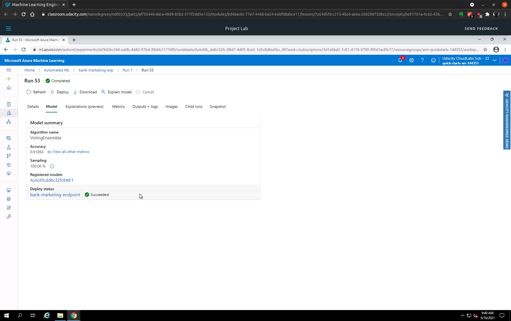

# Udacity Machine Learning Engineer with Microsoft Azure Nanodegree - Project: Operationalizing Machine Learning

- [Overview](#overview)
- [Architectural diagram](#architectural-diagram)
- [Key steps](#key-steps)
  - [Step 1: Authentication](#step-1-authentication)
  - [Step 2: AutoML experiment](#step-2-automl-experiment)
  - [Step 3: Deploy the best model and enable logging](#step-3-deploy-the-best-model-and-enable-logging)
  - [Step 4: Consume model endpoints](#step-4-consume-model-endpoints)
  - [Step 5: Create, publish and consume pipeline](#step-5-create-publish-and-consume-pipeline)
- [Demo](#demo)
- [Future work](#future-work)
- [References](#references)
- [Requirements](#requirements)
- [License](#license)

## Overview

This project is part of the Udacity Azure ML Nanodegree. It performs an AutoML run on the [bank marketing dataset](https://archive.ics.uci.edu/ml/datasets/Bank+Marketing) and deploys the best model obtained from AutoML as a RESTful API web service. The project builds pipeline automation to improve machine learning operations.

The main steps performed in this project are:

## Architectural diagram

 - [Step 1: Authentication](#step-1-authentication)
 - [Step 2: AutoML experiment](#step-2-automl-experiment)
 - [Step 3: Deploy the best model and enable logging](#step-3-deploy-the-best-model-and-enable-logging)
 - [Step 4: Consume model endpoints](#step-4-consume-model-endpoints)
 - [Step 5: Create, publish and consume pipeline](#step-5-create-publish-and-consume-pipeline)

## Key steps

### Step 1: Authentication

Authentication is skipped in this project as it is using the lab Udacity provided. Using the lab, I am not authorized to create a security principal.

If you are using your own Azure account, you will need to install the [Azure Machine Learning Extension](https://docs.microsoft.com/en-us/azure/machine-learning/reference-azure-machine-learning-cli) which allows you to interact with Azure Machine Learning Studio, part of the [`az`](https://docs.microsoft.com/en-us/cli/azure/install-azure-cli) command. After having the Azure machine Learning Extension, you will create a Service Principal account and associate it with your specific workspace.

### Step 2: AutoML experiment

First, we upload and register the bank marketing dataset:

Then we create an AutoML experiment with the bank marketing dataset and the following configuration:

- Classification
- Explain best model
- Exit criterion: 1 hour
- Concurrency: 5

While creating the AutoML experiment, we also have to create a compute cluster with the following configuration:

- Standard_DS12_v2 for virtual machine size
- 1 for minimum number of nodes
- 5 for maximum number of nodes

Automated ML runs:

Automated ML completed:

### Step 3: Deploy the best model and enable logging

The best model after the experiment completes:

We deploy the best model:

The script [`logs.py`](./logs.py) enables Application Insights. Application Insights settings before executing `logs.py`:

Application Insight settings after executing `logs.py`:

Output of `logs.py`:

### Step 4: Consume model endpoints

In this step, you will consume the deployed model using Swagger.

Azure provides a Swagger JSON file for deployed models. Head to the Endpoints section, find your deployed model there, and store `swagger.json` in the `swagger` directory. Then execute `swagger.sh` and `serve.py` in the `swagger` directory:

- `swagger.sh` will download the latest Swagger container, and it will run it on port `9000`
- `serve.py` will start a Python server on port `8000`. Note: this will not work if swagger.json is not on the same directory.

Once the model is deployed, use the `endpoint.py` script provided to interact with the trained model. In this step, you need to run the script, modifying both the `scoring_uri` and the `key` to match the key for your service and the URI that was generated after deployment:

### Step 5: Create, publish and consume pipeline

To create, publish and consume the pipeline, you have to run through all the cells in the provided Jupyter notebook [`aml-pipelines-with-automated-machine-learning-step.ipynb`](./aml-pipelines-with-automated-machine-learning-step.ipynb).

The pipeline created:

The pipeline endpoints:

Endpoint details:

The bank marketing dataset with the AutoML models:

The REST endpoint:

The Jupyter notebook showing the "Use RunDetails Widget":

## Demo

See [here](https://youtu.be/CwVrYwQpnyU) for a video demonstrating the project.

## Future work

- Enable Deep Learning in AutoML: Deep Learning was disabled in AutoML and it would be interesting to see if enabling it would yield better results
- Data imbalance: The data has a class imbalance issue as identified by AutoML; for a better accuracy the data should be balanced before model training
- No data cleaning was applied before running AutoML: By applying data cleaning, accuracy could be increased
- `AUC Weighted` was used in the AutoML run: The results could be compared to `Accuracy` to see which parameter provides better performance
- Limited training time: Training time was limited in AutoML; the accuracy of the model created could be improved with more training time.

## References

- [Set up authentication for Azure Machine Learning resources and workflows](https://docs.microsoft.com/en-us/azure/machine-learning/how-to-setup-authentication)
- [Troubleshooting remote model deployment](https://docs.microsoft.com/en-us/azure/machine-learning/how-to-troubleshoot-deployment?tabs=azcli)
- [Monitor and collect data from ML web service endpoints](https://docs.microsoft.com/en-us/azure/machine-learning/how-to-enable-app-insights)
- [Consume an Azure Machine Learning model deployed as a web service](https://docs.microsoft.com/en-us/azure/machine-learning/how-to-consume-web-service?tabs=python)
- [Apache HTTP server benchmarking tool](https://httpd.apache.org/docs/2.4/programs/ab.html)
- [What are Azure Machine Learning pipelines?](https://docs.microsoft.com/en-us/azure/machine-learning/concept-ml-pipelines)
- [Create and run machine learning pipelines with Azure Machine Learning SDK](https://docs.microsoft.com/en-us/azure/machine-learning/how-to-create-machine-learning-pipelines)
- [PipelineEndpoint Class](https://docs.microsoft.com/en-us/python/api/azureml-pipeline-core/azureml.pipeline.core.pipeline_endpoint.pipelineendpoint?view=azure-ml-py)

## Requirements

Graded according to the [Project Rubric](https://review.udacity.com/#!/rubrics/2893/view).

## License

- **[MIT license](http://opensource.org/licenses/mit-license.php)**
- Copyright 2021 © [Thomas Weibel](https://github.com/thom).
